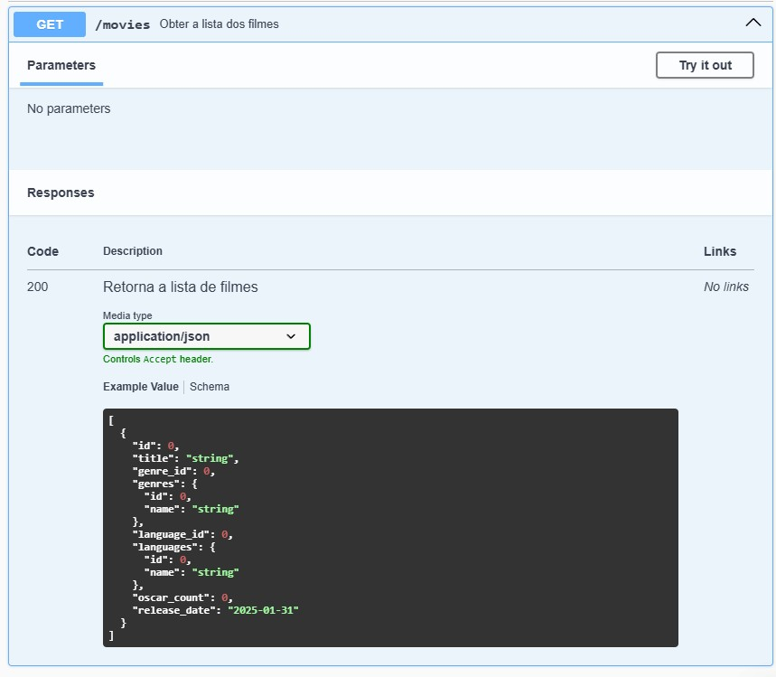
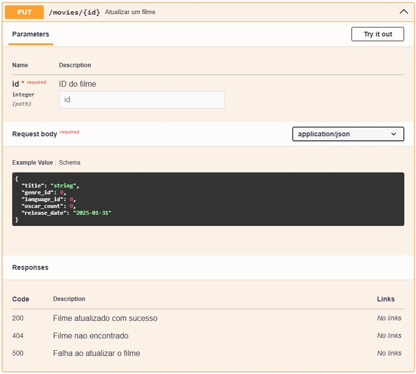
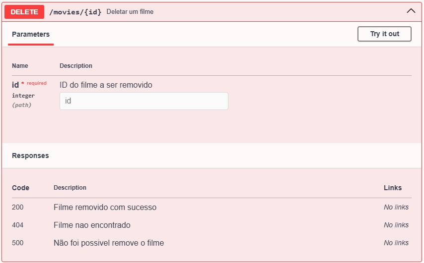
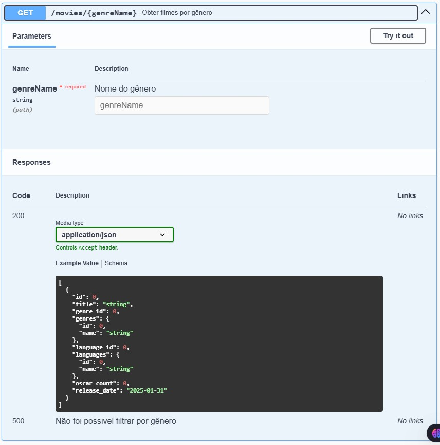
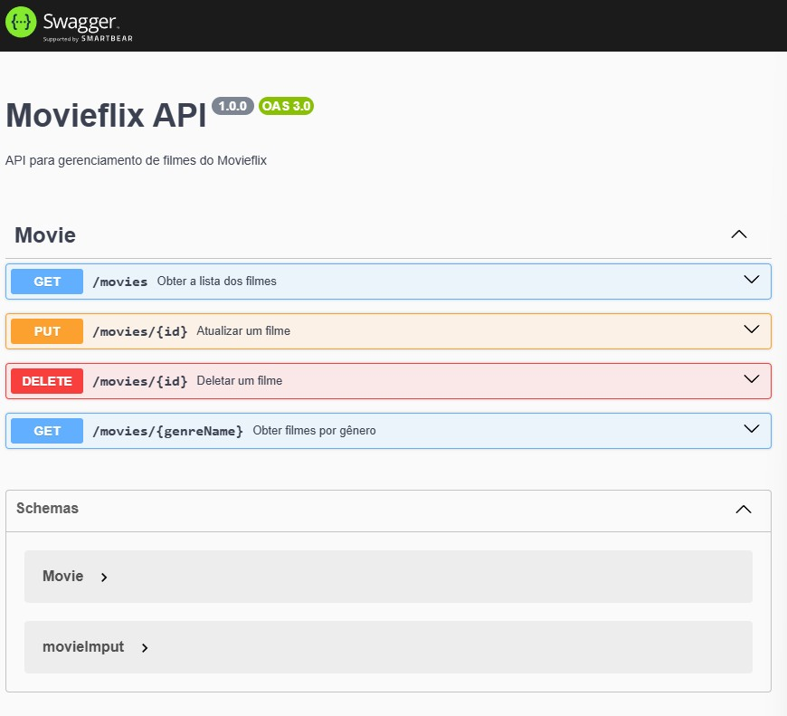

# MovieFlixAPI / Projeto Backend

## Desrição 📝
Projeto simples que tem como finalidade a criação de um banco de dados e posteriormente, a sua manipulação feita por API.

Seu funcionamento consiste em manulipação de dado de um banco como:

    * Obter a lista dos filmes
 
 
    * Atualizar um filme
 

    * Deletar um filme
  

    * Obter filmes por gênero
  

 

OBS: imagens do Swagger UI

## Tecnologias usadas 🖥️
    * Node.js
    * Express
    * Typescript
    * PostegresSQL
    * Prisma
    * Swagger para documentar API 

## Dificuldades ⚒️
    Por ser a primeira vez de forma massiva, a documentação do Swagger tive um pouco de dificuldade, mas é questao de prática e vou resolver isso.

 
 